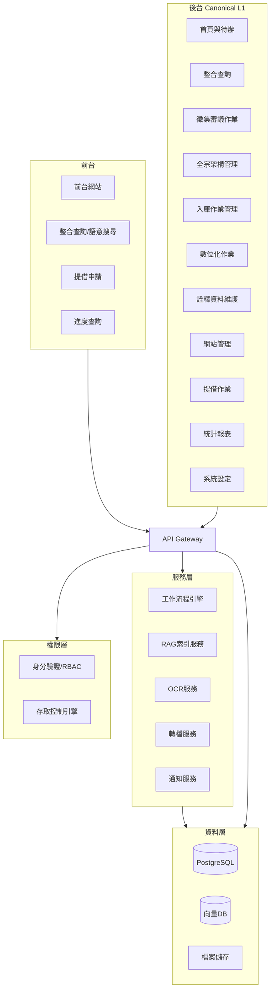
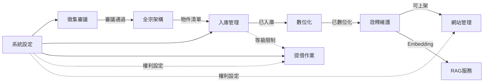

# 數位典藏系統｜整體架構與模組切分

> **文件版本**：v1.0 | **最後更新**：2026-01-09  
> **相關文件**：[001-spec-modules-backend-menu.md](./001-spec-modules-backend-menu.md)

---

## 1. 架構總覽

---

## 2. 層級職責

| 層級 | 元件 | 職責 |
|------|------|------|
| **前台** | 前台網站 | 典藏瀏覽、主題單元、搜尋 |
| | 提借申請 | 實體/數位/影音提借 |
| | 進度查詢 | 捐贈案件進度（可控露出） |
| **後台** | 11個 L1 模組 | 詳見第 3 節 |
| **服務層** | 工作流程引擎 | 多層簽核、狀態機 |
| | RAG 服務 | Embedding、向量索引 |
| | OCR 服務 | 文字擷取 |
| | 轉檔服務 | TIFF→JPEG、縮圖 |
| | 通知服務 | Email/EIP |
| **資料層** | PostgreSQL | 主資料庫 |
| | 向量資料庫 | pgvector/Pinecone |
| | 檔案儲存 | S3/MinIO |
| **權限層** | RBAC | 角色權限 |
| | 存取控制 | 依角色/IP/權利/等級控制 |

---

## 3. Canonical L1 模組定義

| L1 模組 | 核心職責 | 資料主體 |
|--------|---------|---------|
| 整合查詢 | 後台統一查詢、交叉檢索 | 全系統 |
| 首頁與待辦 | 儀表板、待辦、通知 | 任務、通知 |
| 徵集審議作業 | 案件、評估、審議、取得 | 徵集案件/項目 |
| 全宗架構管理 | 階層結構、批次匯入匯出 | 全宗/系列/卷/件 |
| 入庫作業管理 | 點收、編碼、保存地、修護 | 入庫批次、修護單 |
| 數位化作業 | 數位化專案、QC | 數位化案件、檔案 |
| 詮釋資料維護 | 編目、OCR、Schema、審核 | Metadata |
| 網站管理 | 網站架構、上稿、審核 | 網站頁面 |
| 提借(閱)作業 | 申請、簽核、狀態 | 提借案件 |
| 資料統計及報表 | 統計、報表、稽核 | 統計/Log |
| 系統設定 | 帳號/權限、參數、規則 | 使用者、參數 |

---

## 4. 模組依賴關係

### 4.1 依賴說明

| 模組 | 上游依賴 | 下游輸出 |
|------|---------|---------|
| 徵集審議 | 系統設定（流程） | 全宗架構（通過清單） |
| 全宗架構 | 徵集審議 | 入庫管理（物件） |
| 入庫管理 | 全宗架構 | 數位化（物件）、提借（限制旗標） |
| 數位化 | 入庫管理 | 詮釋維護（檔案） |
| 詮釋維護 | 數位化 | 網站管理（上架）、RAG（索引） |
| 提借作業 | 入庫（等級）、系統設定（權利） | — |

---

## 5. 模組邊界定義

### 5.1 徵集審議作業
- ✅ 案件 CRUD、流水號、評估、審議、取得、附件版本
- ❌ 不負責正式階層（全宗/系列）
- **輸出**：審議通過物件 → 全宗架構

### 5.2 全宗架構管理
- ✅ 全宗/系列/卷/件 CRUD、樹狀編輯、批次匯入匯出
- ❌ 不處理入庫點收、不產生館藏號
- **輸出**：物件清單 → 入庫管理

### 5.3 入庫作業管理
- ✅ 點收、編碼、保存地、保存分級、修護作業單
- ✅ 觸發等級限制規則
- ❌ 不執行數位化
- **輸出**：已入庫物件 → 數位化、限制旗標 → 提借

### 5.4 數位化作業
- ✅ 案件管理、檔案上傳、縮圖、QC
- ❌ 不執行編目
- **輸出**：已數位化物件 → 詮釋維護

### 5.5 詮釋資料維護
- ✅ 待編目、編目、OCR、Schema、審核
- ✅ 觸發 RAG 索引
- **輸出**：可上架物件 → 網站管理

### 5.6 網站管理
- ✅ 網站架構、主題單元、上稿、審核
- ✅ 依權利決定露出

### 5.7 提借(閱)作業
- ✅ 申請、多層簽核、狀態
- ✅ 受保存等級/權利限制

### 5.8 系統設定
- ✅ 帳號/權限、流程、參數、字典
- 提供給所有模組使用

---

## 6. 技術選型建議

| 層級 | 選項 | 說明 |
|------|------|------|
| 前端 | React + Next.js | SSR/SEO |
| 後端 | Supabase Edge Functions | Serverless |
| 資料庫 | PostgreSQL (Supabase) | RLS 支援 |
| 向量 | pgvector | 內建擴充 |
| 儲存 | Supabase Storage | 大檔案 |
| OCR | Google Vision API | 雲端 |
| 轉檔 | Sharp / FFmpeg | 本地 |

---

> **下一步**：[020-data-model.md](./020-data-model.md)
