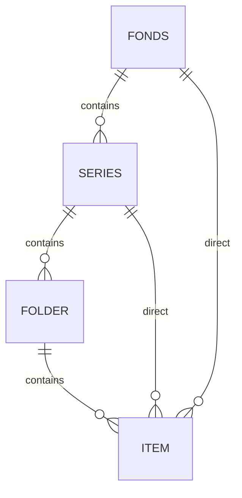
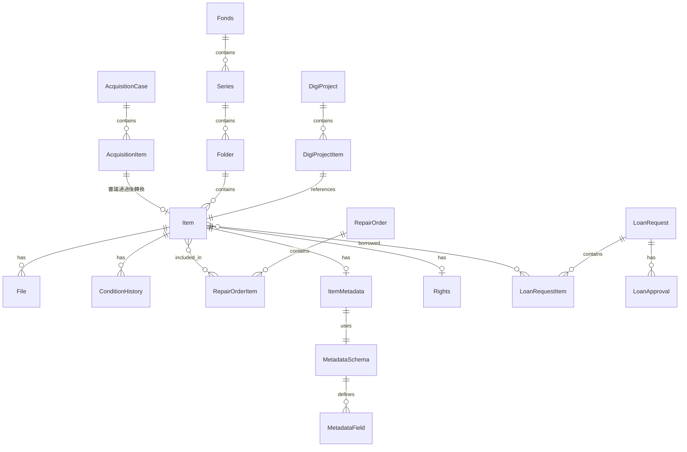

# 數位典藏系統｜資料模型草案

> **文件版本**：v1.0 | **最後更新**：2026-01-09  
> **相關文件**：[010-architecture-overview.md](./010-architecture-overview.md)

---

## 1. 模型總覽

本系統資料模型分為以下核心領域：

| 領域 | 主要實體 |
|------|---------|
| 徵集審議 | AcquisitionCase, AcquisitionItem |
| 全宗階層 | Fonds, Series, Folder, Item |
| 入庫與保存 | IntakeBatch, ConditionHistory, RepairOrder |
| 數位化 | DigiProject, File, FileVersion |
| 詮釋資料 | MetadataSchema, ItemMetadata |
| 權利 | Rights |
| 提借 | LoanRequest, LoanApproval |
| 稽核 | AuditLog, StatsSnapshot |

---

## 2. 徵集審議領域

### 2.1 AcquisitionCase（徵集案件）

| 欄位 | 型態 | 說明 |
|------|------|------|
| id | UUID | 主鍵 |
| case_no | VARCHAR | 案件編號 |
| year | INT | 年度 |
| title | VARCHAR | 案件名稱 |
| status | ENUM | draft/evaluating/pending_review/reviewed/accepted/rejected/completed |
| acquisition_type | ENUM | donation/transfer/purchase/other |
| donor_name | VARCHAR | 捐贈人/原所有者 |
| terms_summary | TEXT | 條款摘要（僅參考） |
| handler_id | UUID FK | 承辦人 |
| created_at | TIMESTAMP | 建立時間 |

### 2.2 AcquisitionItem（徵集項目）

| 欄位 | 型態 | 說明 |
|------|------|------|
| id | UUID | 主鍵 |
| acquisition_case_id | UUID FK | 所屬案件 |
| serial_no | VARCHAR | 流水號/暫編號 |
| name | VARCHAR | 名稱（可空） |
| evaluation_result | ENUM | pending/recommended/not_recommended |
| review_result | ENUM | pending/approved/rejected |
| rejection_reason | TEXT | 否決理由 |

### 2.3 相關表

- **AcquisitionEvaluation**：評估紀錄（overall_conclusion, grading, evaluator_id）
- **AcquisitionMeeting**：會議紀錄（meeting_date, minutes, committee_ids）
- **AcquisitionAttachment**：附件（file_path, type, version）

---

## 3. 全宗階層領域

### 3.1 階層結構

### 3.2 Fonds（全宗）

| 欄位 | 型態 | 說明 |
|------|------|------|
| id | UUID | 主鍵 |
| name | VARCHAR | 全宗名稱 |
| code | VARCHAR | 全宗號 |
| description | TEXT | 描述 |
| created_by | UUID FK | 建立者 |
| created_at | TIMESTAMP | 建立時間 |

### 3.3 Series（系列）

| 欄位 | 型態 | 說明 |
|------|------|------|
| id | UUID | 主鍵 |
| fonds_id | UUID FK | 所屬全宗 |
| parent_series_id | UUID FK | 父系列（可巢狀） |
| name | VARCHAR | 系列名稱 |
| code | VARCHAR | 系列號 |
| sort_order | INT | 排序 |

### 3.4 Folder（卷）

| 欄位 | 型態 | 說明 |
|------|------|------|
| id | UUID | 主鍵 |
| series_id | UUID FK | 所屬系列 |
| name | VARCHAR | 卷名稱 |
| code | VARCHAR | 卷號 |
| sort_order | INT | 排序 |

### 3.5 Item（件）

| 欄位 | 型態 | 說明 |
|------|------|------|
| id | UUID | 主鍵 |
| fonds_id | UUID FK | 所屬全宗 |
| series_id | UUID FK | 所屬系列（nullable） |
| folder_id | UUID FK | 所屬卷（nullable） |
| temp_serial_no | VARCHAR | 流水號/暫編號 |
| accession_no | VARCHAR | 館藏號 |
| title | VARCHAR | 名稱（可空） |
| item_type | VARCHAR | 類型（圖像/文件/影音） |
| status | ENUM | draft/reviewing/accessioned/cataloging/published |
| custom_fields | JSONB | 動態欄位 |
| created_at | TIMESTAMP | 建立時間 |

---

## 4. 入庫與保存領域

### 4.1 IntakeBatch（入庫批次）

| 欄位 | 型態 | 說明 |
|------|------|------|
| id | UUID | 主鍵 |
| batch_no | VARCHAR | 批次編號 |
| intake_date | DATE | 入庫日期 |
| status | ENUM | pending/in_progress/completed |
| handler_id | UUID FK | 承辦人 |
| notes | TEXT | 備註 |

### 4.2 ConditionHistory（保存狀況歷程）

| 欄位 | 型態 | 說明 |
|------|------|------|
| id | UUID | 主鍵 |
| item_id | UUID FK | 物件 |
| grade | INT | 等級（1-4，1最佳） |
| description | TEXT | 描述 |
| change_reason | TEXT | 變更原因 |
| inspector_id | UUID FK | 檢視人 |
| inspected_at | TIMESTAMP | 檢視時間 |

### 4.3 RepairOrder（修護作業單）

| 欄位 | 型態 | 說明 |
|------|------|------|
| id | UUID | 主鍵 |
| order_no | VARCHAR | 作業單編號 |
| status | ENUM | draft/pending_approval/in_progress/pending_acceptance/completed/closed |
| assignee_id | UUID FK | 修護人（館內） |
| vendor_name | VARCHAR | 外包單位 |
| start_date | DATE | 起始日期 |
| end_date | DATE | 結束日期 |
| priority | INT | 優先序 |
| estimated_cost | DECIMAL | 預估費用（選配） |
| location | VARCHAR | 送修地點 |
| created_by | UUID FK | 建立者 |
| created_at | TIMESTAMP | 建立時間 |

### 4.4 RepairOrderItem（修護項目）

| 欄位 | 型態 | 說明 |
|------|------|------|
| id | UUID | 主鍵 |
| repair_order_id | UUID FK | 所屬修護單 |
| item_id | UUID FK | 物件 |
| pre_repair_note | TEXT | 修護前說明 |
| post_repair_note | TEXT | 修護後說明 |
| grade_before | INT | 修護前等級 |
| grade_after | INT | 修護後等級 |

### 4.5 CustodyLog（交付回收紀錄）

| 欄位 | 型態 | 說明 |
|------|------|------|
| id | UUID | 主鍵 |
| repair_order_id | UUID FK | 修護單 |
| event | ENUM | sent_out/received_back |
| event_date | DATE | 事件日期 |
| signed_by | VARCHAR | 簽收人 |
| notes | TEXT | 備註 |

---

## 5. 數位化領域

### 5.1 DigiProject（數位化案件）

| 欄位 | 型態 | 說明 |
|------|------|------|
| id | UUID | 主鍵 |
| project_no | VARCHAR | 案件編號 |
| title | VARCHAR | 案件名稱 |
| year | INT | 年度 |
| status | ENUM | draft/in_progress/qc_pending/completed |
| owner_id | UUID FK | 負責人 |
| created_at | TIMESTAMP | 建立時間 |

### 5.2 DigiProjectItem（案件物件）

| 欄位 | 型態 | 說明 |
|------|------|------|
| id | UUID | 主鍵 |
| digi_project_id | UUID FK | 案件 |
| item_id | UUID FK | 物件 |
| qc_status | ENUM | pending/passed/rejected |
| qc_notes | TEXT | QC 備註 |

### 5.3 File（檔案）

| 欄位 | 型態 | 說明 |
|------|------|------|
| id | UUID | 主鍵 |
| item_id | UUID FK | 物件 |
| file_category | ENUM | original/digitized/thumbnail/derivative |
| mime_type | VARCHAR | MIME 類型 |
| storage_path | VARCHAR | 儲存路徑 |
| size_bytes | BIGINT | 檔案大小 |
| metadata | JSONB | EXIF/解析度/頁數 |
| created_by | UUID FK | 上傳者 |
| created_at | TIMESTAMP | 建立時間 |

### 5.4 FileVersion（檔案版本）

| 欄位 | 型態 | 說明 |
|------|------|------|
| id | UUID | 主鍵 |
| file_id | UUID FK | 檔案 |
| version_no | INT | 版本號 |
| storage_path | VARCHAR | 儲存路徑 |
| change_reason | VARCHAR | 變更原因 |
| created_by | UUID FK | 建立者 |
| created_at | TIMESTAMP | 建立時間 |

---

## 6. 詮釋資料領域

### 6.1 MetadataSchema（資料類型/Template）

| 欄位 | 型態 | 說明 |
|------|------|------|
| id | UUID | 主鍵 |
| name | VARCHAR | 資料類型名稱 |
| description | TEXT | 描述 |
| is_default | BOOLEAN | 是否預設 |
| created_at | TIMESTAMP | 建立時間 |

### 6.2 MetadataField（欄位定義）

| 欄位 | 型態 | 說明 |
|------|------|------|
| id | UUID | 主鍵 |
| schema_id | UUID FK | 所屬 Schema |
| field_key | VARCHAR | 欄位鍵 |
| label | VARCHAR | 顯示名稱 |
| data_type | ENUM | text/date/number/select/multi_select/relation |
| is_required | BOOLEAN | 是否必填 |
| is_multi_value | BOOLEAN | 是否多值 |
| display_order | INT | 顯示順序 |
| options | JSONB | 選項/預設值 |

### 6.3 ItemMetadata（物件詮釋資料）

| 欄位 | 型態 | 說明 |
|------|------|------|
| id | UUID | 主鍵 |
| item_id | UUID FK | 物件 |
| schema_id | UUID FK | 使用的 Schema |
| values | JSONB | key-value pairs |
| review_status | ENUM | draft/pending_review/approved/rejected |
| reviewer_id | UUID FK | 審核者 |
| reviewed_at | TIMESTAMP | 審核時間 |
| review_comment | TEXT | 審核意見 |

### 6.4 ItemMetadataHistory（版本差異）

| 欄位 | 型態 | 說明 |
|------|------|------|
| id | UUID | 主鍵 |
| item_metadata_id | UUID FK | 詮釋資料 |
| diff | JSONB | 差異內容 |
| changed_by | UUID FK | 變更者 |
| changed_at | TIMESTAMP | 變更時間 |

---

## 7. 權利領域

### 7.1 Rights（權利設定）

| 欄位 | 型態 | 說明 |
|------|------|------|
| id | UUID | 主鍵 |
| item_id | UUID FK | 物件 |
| rights_status | ENUM | unknown/public_domain/cc_by/cc_by_nc/restricted/confidential |
| cc_license | VARCHAR | CC 授權條款 |
| restrictions | JSONB | 存取限制規則 |
| legal_basis | VARCHAR | 法規依據 |
| contract_ref | VARCHAR | 契約參考（僅作參考，不等於最終權利） |
| notes | TEXT | 備註 |
| updated_by | UUID FK | 更新者 |
| updated_at | TIMESTAMP | 更新時間 |

---

## 8. 提借領域

### 8.1 LoanRequest（提借案件）

| 欄位 | 型態 | 說明 |
|------|------|------|
| id | UUID | 主鍵 |
| request_no | VARCHAR | 案件編號 |
| applicant_id | UUID FK | 申請人 |
| request_type | ENUM | physical/digital/audiovisual |
| status | ENUM | submitted/under_review/approved/rejected/loaned/returned/closed |
| request_date | DATE | 申請日期 |
| expected_return_date | DATE | 預計歸還日期 |
| purpose | TEXT | 申請目的 |
| created_at | TIMESTAMP | 建立時間 |

### 8.2 LoanRequestItem（申請項目）

| 欄位 | 型態 | 說明 |
|------|------|------|
| id | UUID | 主鍵 |
| loan_request_id | UUID FK | 案件 |
| item_id | UUID FK | 物件 |
| item_status | ENUM | pending/approved/rejected/returned |
| notes | TEXT | 備註 |

### 8.3 LoanApproval（簽核紀錄）

| 欄位 | 型態 | 說明 |
|------|------|------|
| id | UUID | 主鍵 |
| loan_request_id | UUID FK | 案件 |
| approval_level | INT | 簽核層級 |
| approver_id | UUID FK | 簽核者 |
| decision | ENUM | approved/rejected/pending |
| comment | TEXT | 意見 |
| decided_at | TIMESTAMP | 決定時間 |

### 8.4 LoanStatusLog（狀態歷程）

| 欄位 | 型態 | 說明 |
|------|------|------|
| id | UUID | 主鍵 |
| loan_request_id | UUID FK | 案件 |
| from_status | ENUM | 原狀態 |
| to_status | ENUM | 新狀態 |
| changed_by | UUID FK | 變更者 |
| changed_at | TIMESTAMP | 變更時間 |

---

## 9. 稽核領域

### 9.1 AuditLog（稽核紀錄）

| 欄位 | 型態 | 說明 |
|------|------|------|
| id | UUID | 主鍵 |
| user_id | UUID FK | 操作者 |
| action | VARCHAR | create/update/delete/view/download/approve |
| entity_type | VARCHAR | 實體類型 |
| entity_id | UUID | 實體 ID |
| old_value | JSONB | 舊值 |
| new_value | JSONB | 新值 |
| ip_address | VARCHAR | IP 位址 |
| created_at | TIMESTAMP | 時間 |

### 9.2 StatsSnapshot（統計快照）

| 欄位 | 型態 | 說明 |
|------|------|------|
| id | UUID | 主鍵 |
| snapshot_date | DATE | 快照日期 |
| stat_type | ENUM | collection_count/visit/pageview/download/loan |
| data | JSONB | 統計資料 |

---

### 9.3 SystemConfig（系統設定）

| 欄位 | 型態 | 說明 |
|------|------|------|
| id | UUID | 主鍵 |
| config_key | VARCHAR | 設定鍵值（如 supabase_url） |
| config_value | TEXT | 設定值（可能加密） |
| description | TEXT | 說明 |
| is_encrypted | BOOLEAN | 是否加密 |
| updated_by | UUID FK | 更新者 |
| updated_at | TIMESTAMP | 更新時間 |

---

## 10. 實體關聯總覽

---

> **下一步**：[030-domain-flows.md](./030-domain-flows.md)
