# 數位典藏系統｜領域流程與狀態機

> **文件版本**：v1.0 | **最後更新**：2026-01-09  
> **基於規格**：[002-spec-flows-x-functions-case-xielifa.md](./002-spec-flows-x-functions-case-xielifa.md)、[003-spec-service-blueprint-xielifa.md](./003-spec-service-blueprint-xielifa.md)  
> **一致性規則**：模組名稱以 Canonical L1 為準

---

## 1. 流程總覽（謝里法案例）

依據服務藍圖，完整流程分為三大階段：

| 階段 | 涵蓋步驟 | 對應模組 |
|------|---------|---------|
| **捐贈/徵集審議** | 1-10 | 徵集審議作業、網站管理 |
| **館內作業** | 11-20 | 全宗架構、入庫管理、數位化、詮釋維護、系統設定、網站管理 |
| **前台服務** | 21-24 | 整合查詢、提借作業、統計報表 |

---

## 2. 徵集審議流程

### 2.1 流程圖

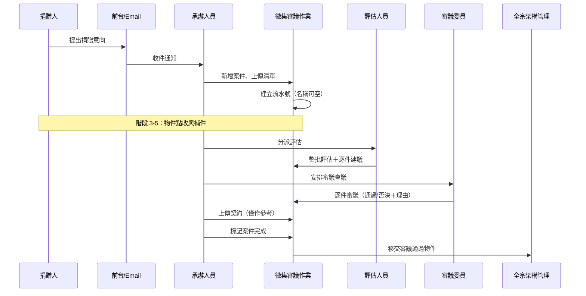

### 2.2 狀態機：AcquisitionCase

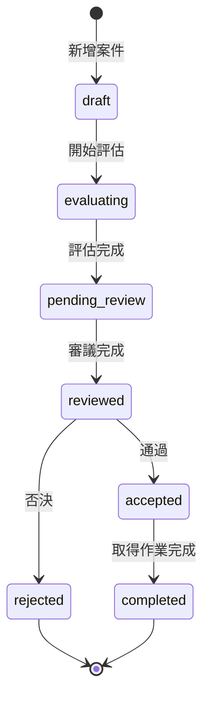

### 2.3 狀態機：AcquisitionItem

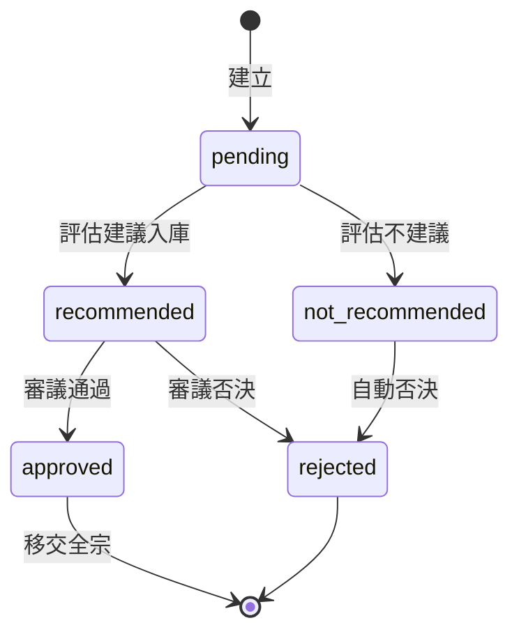

### 2.4 資料流

| 步驟 | 輸入 | 處理 | 輸出 |
|------|------|------|------|
| 建立案件 | 捐贈清單 | 產生案件＋流水號 | AcquisitionCase, AcquisitionItem |
| 評估 | 物件清單 | 逐件評估 | evaluation_result |
| 審議 | 評估結果 | 逐件通過/否決 | review_result, rejection_reason |
| 完成 | 通過清單 | 鎖定清單 | 移交至 Item（全宗架構） |

---

## 3. 入庫＋保存修護流程

### 3.1 流程圖

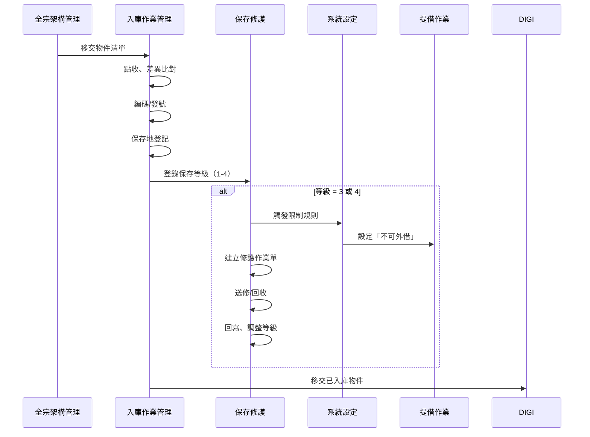

### 3.2 狀態機：IntakeBatch

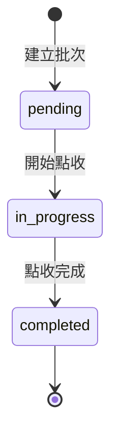

### 3.3 狀態機：RepairOrder

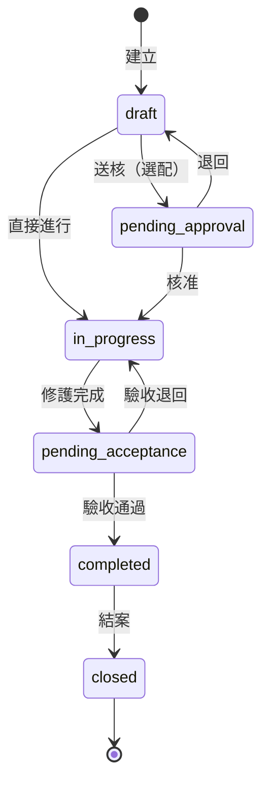

### 3.4 保存等級限制規則

| 等級 | 描述 | 實體外借 | 觸發動作 |
|------|------|---------|---------|
| 1 | 最佳 | ✅ 可 | - |
| 2 | 良好 | ✅ 可 | - |
| 3 | 需注意 | ❌ 不可 | 自動限制、建議修護 |
| 4 | 需修護 | ❌ 不可 | 強制限制、建議優先修護 |

---

## 4. 數位化流程

### 4.1 流程圖

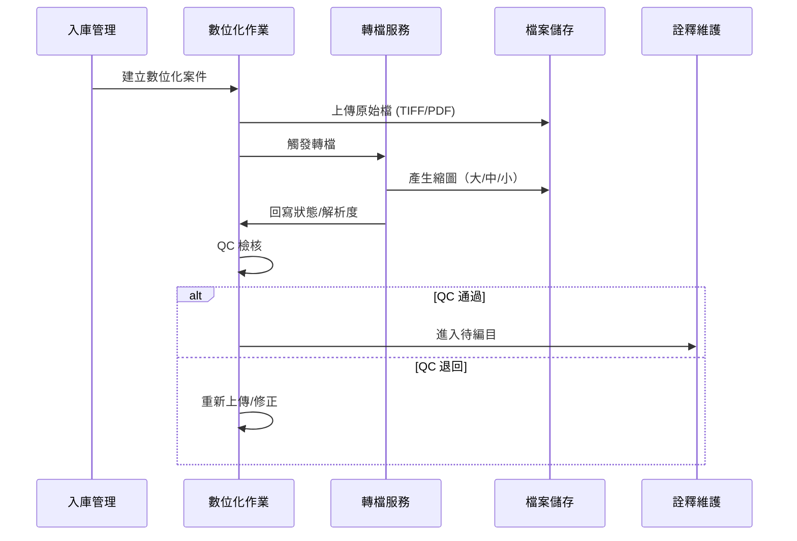

### 4.2 狀態機：DigiProject

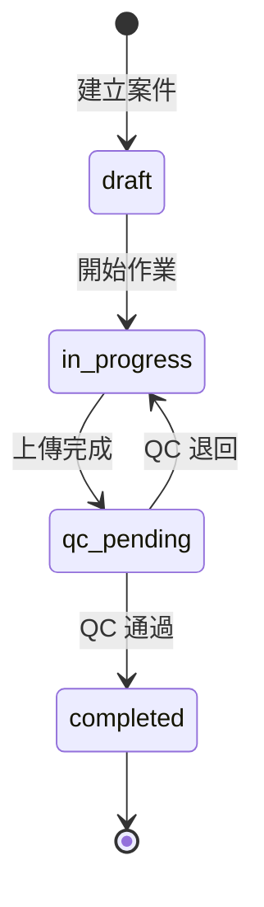

### 4.3 狀態機：DigiTask（轉檔任務）

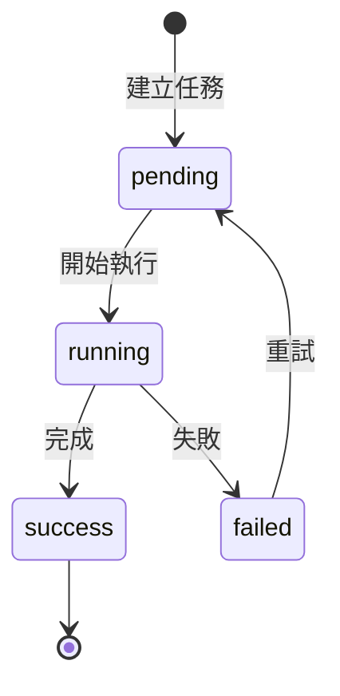

---

## 5. 編目與審核流程

### 5.1 流程圖

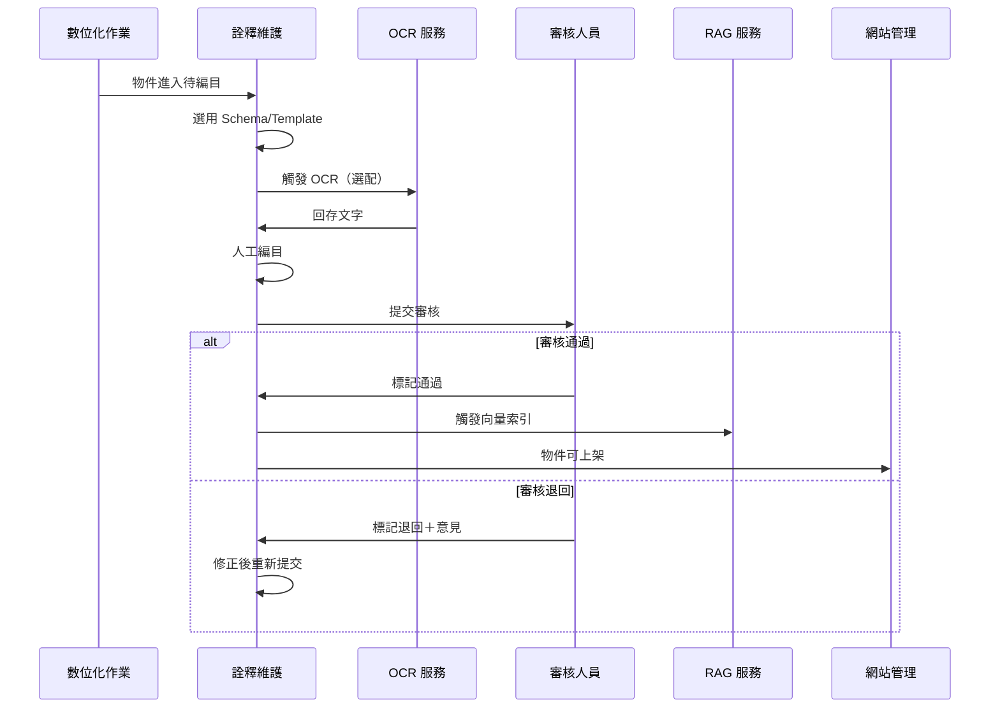

### 5.2 狀態機：ItemMetadata

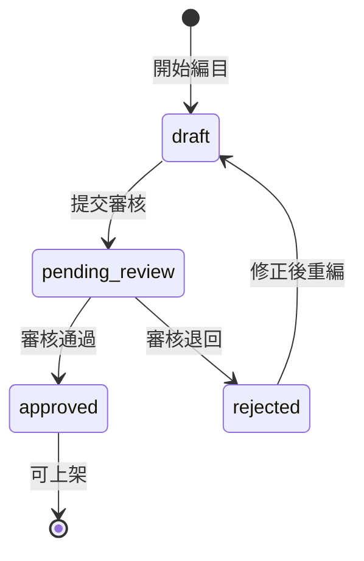

### 5.3 審核版本追溯

每次審核退回/修正產生 `ItemMetadataHistory` 記錄：
- `diff`：JSON 格式的欄位差異
- `changed_by`：修改者
- `changed_at`：修改時間

---

## 6. RAG 索引流程

### 6.1 流程圖

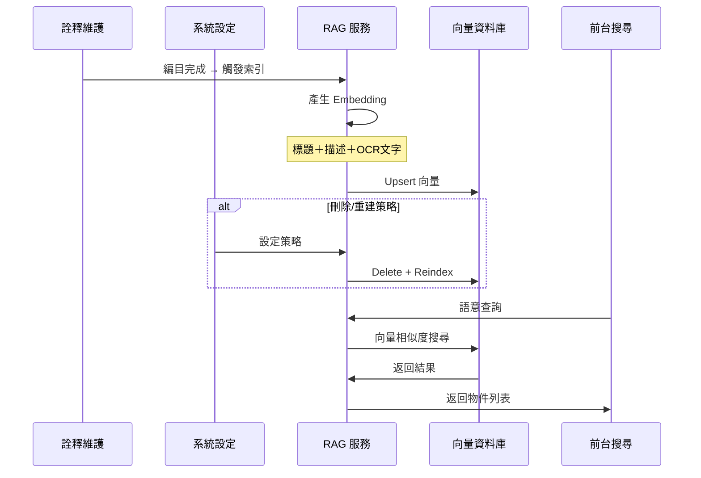

### 6.2 索引策略

| 策略 | 說明 | 使用時機 |
|------|------|---------|
| 增量更新 | 單筆 Upsert | 預設、編目完成時 |
| 批次更新 | 多筆 Upsert | 匯入完成時 |
| 全量重建 | Delete All + Reindex | Schema 變更、模型更換 |

---

## 7. 前台查詢＋提借流程

### 7.1 流程圖

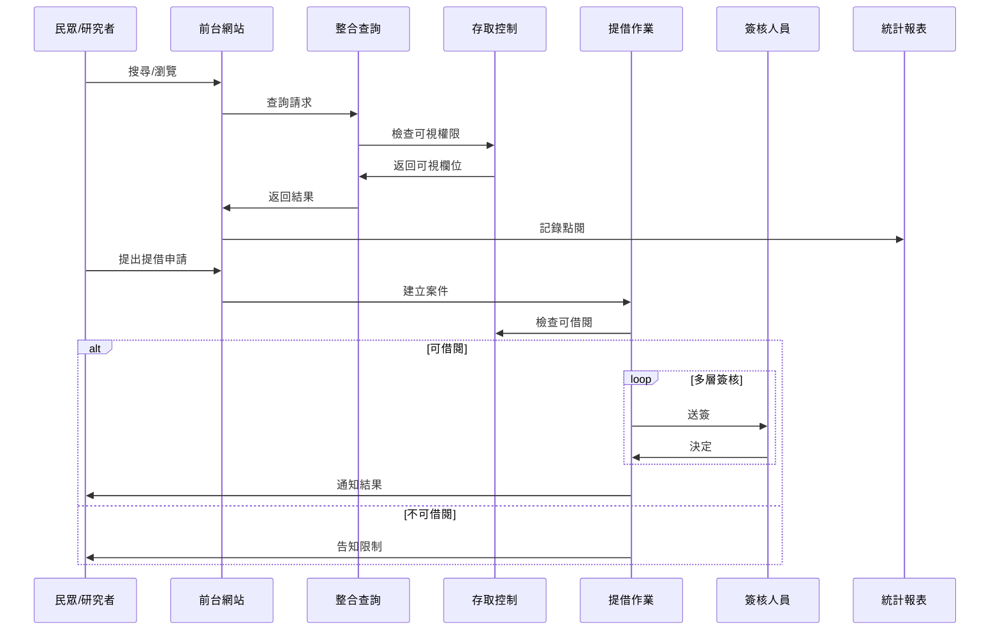

### 7.2 狀態機：LoanRequest

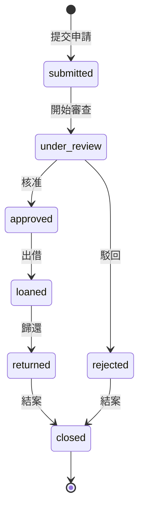

### 7.3 多層簽核配置

簽核流程由 `系統設定 → 工作流程設定` 配置，預設層級：

| 層級 | 角色 | 說明 |
|------|------|------|
| 1 | 承辦 | 初步審查 |
| 2 | 主管 | 單位主管 |
| 3 | 主秘 | 選配 |
| 4 | 副館長 | 選配 |
| 5 | 館長 | 最終核准 |

可依案件類型（實體/數位/影音）設定不同流程。

---

## 8. 服務藍圖對照表

### 8.1 捐贈/徵集階段（階段 1-10）

| 階段 | L1 使用者行為 | L4 Backstage 模組 | 資料異動 |
|------|-------------|------------------|---------|
| 1 | 得知徵集資訊 | 網站管理 | - |
| 2 | 提出捐贈意向 | 徵集審議作業 | 新增 AcquisitionCase |
| 3 | 文物運回 | 徵集審議作業 | 新增 AcquisitionItem（流水號） |
| 4 | 查詢進度 | 網站管理、徵集審議 | 讀取 Case/Item 狀態 |
| 5 | 補充資料 | 徵集審議作業 | 更新 Attachment 版本 |
| 6 | 等待評估 | 徵集審議作業 | 新增 AcquisitionEvaluation |
| 7 | 確認契約 | 徵集審議作業 | 更新 Attachment（契約） |
| 8 | 等待審議 | 徵集審議作業 | 新增 Meeting，更新 Item review_result |
| 9 | 確認範圍 | 徵集審議作業 | 鎖定通過清單 |
| 10 | 捐贈完成 | 徵集審議作業 | Case → completed |

### 8.2 館內作業階段（階段 11-20）

| 階段 | L1 使用者行為 | L4 Backstage 模組 | 資料異動 |
|------|-------------|------------------|---------|
| 11 | 建立全宗結構 | 全宗架構管理 | 新增 Fonds/Series/Folder/Item |
| 12 | 正式入庫 | 入庫作業管理 | 新增 IntakeBatch，Item.accession_no |
| 13 | 登錄保存等級 | 入庫→保存修護 | 新增 ConditionHistory |
| 14 | 觸發限制 | 系統設定、提借 | 更新 Item 限制旗標 |
| 15 | 建立修護案 | 入庫→保存修護 | 新增 RepairOrder, RepairOrderItem |
| 16 | 送修/修護中 | 入庫→保存修護 | 新增 CustodyLog |
| 17 | 修護完成 | 入庫→保存修護 | 更新 RepairOrder, ConditionHistory |
| 18 | 數位化 | 數位化作業 | 新增 DigiProject, File |
| 19 | 編目/審核 | 詮釋維護 | 新增 ItemMetadata |
| 20 | 權利/索引/上架 | 系統設定、詮釋維護、網站管理 | 新增 Rights, Vector, 發布 |

### 8.3 前台服務階段（階段 21-24）

| 階段 | L1 使用者行為 | L4 Backstage 模組 | 資料異動 |
|------|-------------|------------------|---------|
| 21 | 搜尋瀏覽 | 整合查詢 | 讀取 + StatsSnapshot |
| 22 | 提借申請 | 提借作業 | 新增 LoanRequest |
| 23 | 審查回覆 | 提借作業 | 新增 LoanApproval |
| 24 | 使用統計 | 統計報表 | 更新 StatsSnapshot |

---

## 9. 一致性規則摘要

| 規則 | 說明 |
|------|------|
| **Canonical L1 命名** | 後台模組名稱統一使用文件 1 定義 |
| **契約 ≠ 最終權利** | 契約僅作參考，權利狀態需獨立盤點 |
| **流水號可空名** | 徵集階段名稱可空，需有唯一流水號 |
| **等級限制自動觸發** | 等級 3/4 自動設定不可外借 |
| **版本差異追溯** | Metadata 變更保留 diff history |
| **審核多層簽核** | 簽核流程可配置，依案件類型不同 |

---

> **相關文件**：
> - [010-architecture-overview.md](./010-architecture-overview.md)
> - [020-data-model.md](./020-data-model.md)
