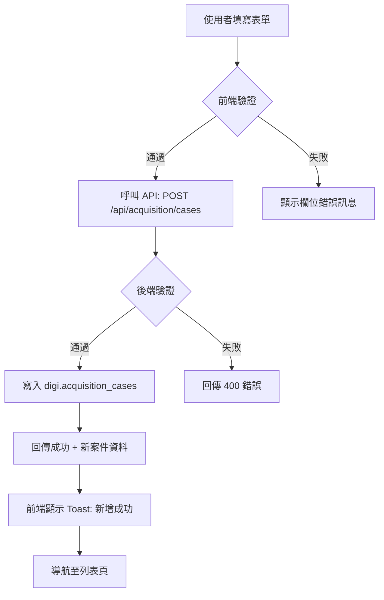

# 徵集案件新增 功能規格書

> **文件版號**：V1.0  
> **產出日期**：2026-01-09  
> **負責人**：數位典藏開發團隊

---

## 1. 模組概述 (Overview)

| 項目 | 說明 |
|------|------|
| **模組目的** | 提供使用者建立新的徵集/捐贈案件紀錄，作為後續審議流程的起點 |
| **目標使用者** | 檔案館管理員、徵集業務承辦人 |
| **核心價值** | 標準化案件登錄流程，確保資料完整性，加速審議作業 |

---

## 2. 功能清單 (Feature List)

| ID | 功能名稱 | User Story |
|----|----------|------------|
| F-001 | 開啟新增表單 | 作為管理員，我希望能從列表頁點擊按鈕進入新增表單，以便快速建立案件。 |
| F-002 | 填寫基本資訊 | 作為管理員，我希望能輸入案件名稱、分類、說明等資訊，以便完整描述案件。 |
| F-003 | 自動產生編號 | 作為管理員，我希望系統自動產生案件編號，以避免人為輸入錯誤。 |
| F-004 | 儲存案件 | 作為管理員，我希望能儲存案件並看到成功訊息，以確認資料已正確寫入。 |
| F-005 | 取消新增 | 作為管理員，我希望能取消新增並返回列表，以便放棄不需要的操作。 |

---

## 3. 重要規則與限制 (Core Business Rules) 🔥

### 3.1 資料驗證 (Data Validation)

| 規則 ID | 類別 | 欄位 | 規則描述 | 錯誤訊息 |
|---------|------|------|----------|----------|
| V-001 | 必填 | 案件名稱 | 不可為空 | 「請輸入案件名稱」 |
| V-002 | 必填 | 分類 | 必須選擇一個選項 | 「請選擇案件分類」 |
| V-003 | 長度限制 | 案件名稱 | 最多 200 字元 | 「案件名稱不可超過 200 字」 |
| V-004 | 長度限制 | 案情概要 | 最多 2000 字元 | 「案情概要不可超過 2000 字」 |
| V-005 | 格式 | 聯絡電話 | 僅限數字與 - 符號 | 「電話格式不正確」 |
| V-006 | 格式 | Email | 須符合 Email 格式 | 「Email 格式不正確」 |

### 3.2 操作限制 (Operation Constraints)

| 規則 ID | 類別 | 規則描述 |
|---------|------|----------|
| O-001 | 自動處理 | 案件編號由系統自動產生，使用者不可修改 |
| O-002 | 自動處理 | 新案件狀態預設為「草稿」 |
| O-003 | 自動處理 | 建立時間自動填入當下時間 |

### 3.3 顯示規則 (Display Rules)

| 規則 ID | 規則描述 |
|---------|----------|
| D-001 | 必填欄位標籤後方顯示紅色 * 符號 |
| D-002 | 欄位驗證錯誤時，輸入框邊框變為紅色，下方顯示錯誤訊息 |
| D-003 | 儲存按鈕在提交期間顯示 Loading 狀態，防止重複提交 |

### 3.4 權限控制 (Permission / Access Control)

| 規則 ID | 角色 | 權限描述 |
|---------|------|----------|
| P-001 | 管理員 | 可新增案件 |
| P-002 | 一般成員 | 可新增案件 (需登入) |
| P-003 | 訪客 | 禁止存取，重導向至登入頁 |

---

## 4. 介面互動與流程 (UI Interaction Flow)

### 4.1 案件列表頁 → 新增入口

- **畫面構成**：列表頁右上角有「新增案件」按鈕
- **使用者操作**：點擊「新增案件」按鈕
- **系統回饋**：導航至 `/admin/acquisition/create`

### 4.2 案件新增表單

- **畫面構成**：
  ```
  ┌─────────────────────────────────────────┐
  │ 📋 新增徵集案件                      [X] │
  ├─────────────────────────────────────────┤
  │ 案件名稱 *     [____________________]   │
  │ 分類 *         [▼ 請選擇分類]          │
  │ 申請人/單位    [____________________]   │
  │ 聯絡電話       [____________________]   │
  │ Email          [____________________]   │
  │ 案情概要       [____________________]   │
  │                [____________________]   │
  │                [____________________]   │
  ├─────────────────────────────────────────┤
  │                    [取消]  [儲存]       │
  └─────────────────────────────────────────┘
  ```

- **欄位說明**：
  | 欄位 | 類型 | 必填 | 說明 |
  |------|------|------|------|
  | 案件名稱 | 文字輸入 | ✅ | 案件的主要標題 |
  | 分類 | 下拉選單 | ✅ | 選項：捐贈、移撥、價購、徵集 |
  | 申請人/單位 | 文字輸入 | ❌ | 捐贈者或移撥單位名稱 |
  | 聯絡電話 | 文字輸入 | ❌ | 連絡用電話 |
  | Email | 文字輸入 | ❌ | 連絡用電子郵件 |
  | 案情概要 | 多行文字 | ❌ | 案件相關描述 |

- **按鈕操作**：
  | 按鈕 | 行為 |
  |------|------|
  | 儲存 | 執行驗證 → 呼叫 API → 成功則導回列表並顯示 Toast |
  | 取消 | 直接導回列表頁，不儲存任何資料 |

---

## 5. 資料欄位定義 (Data Dictionary - Business View)

| 欄位名稱 | 欄位含義 | 資料格式範例 | 必填 | 驗證規則 |
|----------|----------|--------------|------|----------|
| 案件編號 | 唯一識別碼 | ACQ-2026-001 | 自動 | 系統產生 |
| 案件名稱 | 案件標題 | 謝里法檔案捐贈案 | ✅ | V-001, V-003 |
| 分類 | 徵集類型 | 捐贈 | ✅ | V-002 |
| 申請人 | 來源方名稱 | 謝里法先生 | ❌ | - |
| 聯絡電話 | 連絡電話 | 02-1234-5678 | ❌ | V-005 |
| Email | 電子郵件 | example@mail.com | ❌ | V-006 |
| 案情概要 | 詳細說明 | (長文) | ❌ | V-004 |
| 狀態 | 處理狀態 | 草稿 | 自動 | 預設「草稿」|
| 建立時間 | 建立時間戳 | 2026-01-09 10:30 | 自動 | 系統產生 |

---

## 6. 資料流向 (Data Flow)



---

## 7. 測試案例 (Test Cases)

### TC-001: 成功新增案件 ✅

- **測試類型**: 正向測試 (Happy Path)
- **前置條件**: 使用者已登入
- **操作步驟**:
  1. 導航至 `/admin/acquisition/list`
  2. 點擊「新增案件」按鈕
  3. 在「案件名稱」欄位輸入：`自動化測試案件`
  4. 在「分類」下拉選單選擇：`捐贈`
  5. 點擊「儲存」按鈕
- **預期結果**: 
  - 頁面顯示成功訊息
  - 自動導回列表頁
  - 列表中出現名為「自動化測試案件」的新紀錄
- **對應規則**: [V-001], [V-002], [O-001], [O-002]

---

### TC-002: 案件名稱為空時顯示錯誤 ❌

- **測試類型**: 負向測試 (Validation)
- **前置條件**: 使用者已登入，位於新增表單頁
- **操作步驟**:
  1. 不輸入「案件名稱」
  2. 選擇分類：`捐贈`
  3. 點擊「儲存」按鈕
- **預期結果**: 
  - 案件名稱欄位下方顯示錯誤訊息：「請輸入案件名稱」
  - 頁面不跳轉，保持在表單頁
- **對應規則**: [V-001], [D-002]

---

### TC-003: 未選擇分類時顯示錯誤 ❌

- **測試類型**: 負向測試 (Validation)
- **前置條件**: 使用者已登入，位於新增表單頁
- **操作步驟**:
  1. 輸入案件名稱：`測試案件`
  2. 不選擇分類 (保持預設「請選擇」)
  3. 點擊「儲存」按鈕
- **預期結果**: 
  - 分類欄位下方顯示錯誤訊息：「請選擇案件分類」
  - 頁面不跳轉
- **對應規則**: [V-002], [D-002]

---

### TC-004: 案件名稱超過長度限制 ❌

- **測試類型**: 負向測試 (Boundary)
- **前置條件**: 使用者已登入，位於新增表單頁
- **操作步驟**:
  1. 在「案件名稱」輸入 201 個字元的文字
  2. 選擇分類：`捐贈`
  3. 點擊「儲存」按鈕
- **預期結果**: 
  - 案件名稱欄位下方顯示錯誤訊息：「案件名稱不可超過 200 字」
- **對應規則**: [V-003]

---

### TC-005: Email 格式錯誤 ❌

- **測試類型**: 負向測試 (Format)
- **前置條件**: 使用者已登入，位於新增表單頁
- **操作步驟**:
  1. 輸入案件名稱：`測試案件`
  2. 選擇分類：`捐贈`
  3. 在 Email 欄位輸入：`invalid-email`
  4. 點擊「儲存」按鈕
- **預期結果**: 
  - Email 欄位下方顯示錯誤訊息：「Email 格式不正確」
- **對應規則**: [V-006]

---

### TC-006: 點擊取消按鈕返回列表 ↩️

- **測試類型**: 功能測試
- **前置條件**: 使用者已登入，位於新增表單頁
- **操作步驟**:
  1. 輸入部分資料
  2. 點擊「取消」按鈕
- **預期結果**: 
  - 直接導回列表頁
  - 不儲存任何資料
  - 不顯示任何確認對話框
- **對應規則**: [F-005]

---

### TC-007: 未登入時禁止存取 🔒

- **測試類型**: 權限測試
- **前置條件**: 使用者**未登入**
- **操作步驟**:
  1. 直接訪問 `/admin/acquisition/create`
- **預期結果**: 
  - 系統自動導向登入頁面 `/login`
- **對應規則**: [P-003]

---

## 8. 變更記錄 (Change Log)

| 版本 | 日期 | 修改者 | 修改說明 |
|------|------|--------|----------|
| V1.0 | 2026-01-09 | 數位典藏開發團隊 | 初版建立 |
